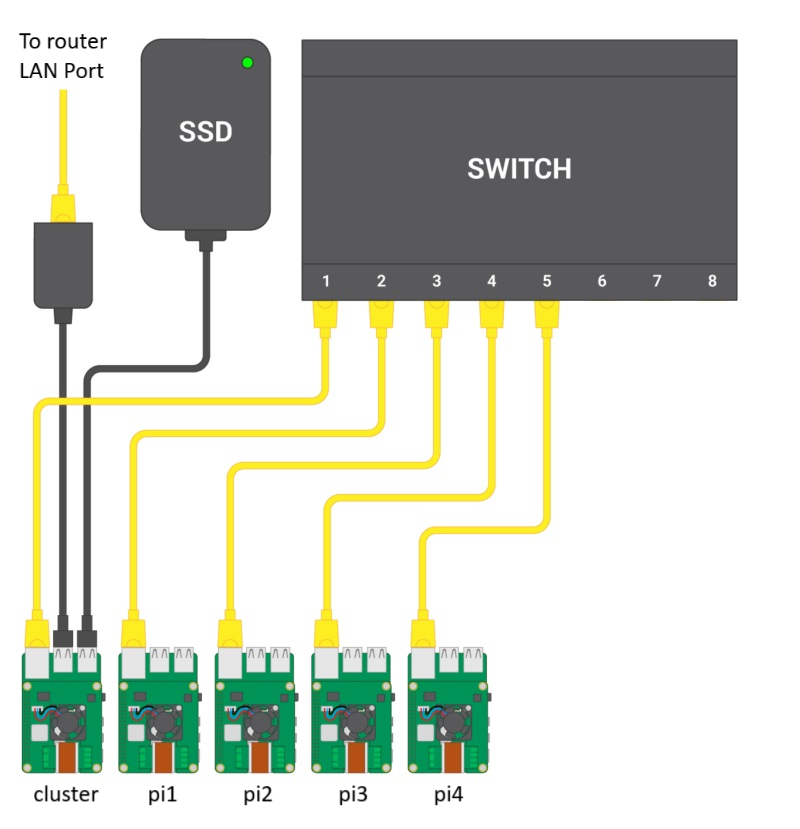

# Introduction
This guide goes through all of the steps necessary to setup a raspberry pi-cluster. One of the Pis will act as a head node and the rest as compute nodes. The compute nodes network boot from the SSD, which is also used as shared storage. For the most part, this guide follows the guide linked below, with modifications made where necessary:
https://www.raspberrypi.com/tutorials/cluster-raspberry-pi-tutorial/

## Hardware
- 5 x Raspberry Pi 4 Model B Rev 1.1
- 5 x Raspberry Pi PoE+ HAT
- 5 x Fans
- 5 x 16-32 GB SD cards (Only 1 necessary)
- 7 x Ethernet cables
- A gigabit router with an ethernet-connection
- A USB-to-Gigabit ethernet adapter
- A 1TB SATA SSD with a SATA to USB connector
- An 8-port Gigabit PoE Switch
- A 3D-printed case for the Raspberry Pis

## Steps

### Raspberry Pi OS installation
Install the Raspberry Pi Imager on a computer and connect an SD card to it.  
Start the imager program and select Raspberry Pi 4 as device, Raspberry Pi OS Lite (64-bit) as the OS and the SD card as storage.  
When prompted to apply OS customisation settings, select edit settings.  
Under General, set the hostname, username and password and locale settings appropriately. Example hostnames:
- cluster (head-node)
- pi1
- pi2
- pi3
- pi4  
  
Under Services, enable SSH.  
Click save, then yes, and run the imaging process.
Repeat the process for each of the remaining SD cards.

### Hardware
Insert the SD cards into the head and compute nodes according to their hostnames, as in the image.  
Mount a fan and Raspberry Pi PoE hat on each of the Raspberry Pis, then mount them in the case.  
Connect the router to the internet.  
Connect an ethernet cable to one of the LAN ports on the router, and the other end to the USB-to-Gigabit ethernet adapter, which then goes into a USB port on the cluster head-node.  
Connect the SATA SSD to one of the other USB ports on the head-node.  
Finally, connect each Raspberry PI to the switch with the ethernet cables. 
  
**Hardware diagram**

Original image credit: https://www.raspberrypi.com/tutorials/cluster-raspberry-pi-tutorial/#what-were-going-to-build

### Software
#### Connecting to the head node
Begin by going to your browsers clients/DHCP interface. The head-node should have been issued a local IP. Connect to the head-node by running the following ssh command, assuming the username is cluster and IP is 192.168.0.101:  
```bash
ssh cluster@192.168.0.101
```
#### Configure network and DHCP-server
Initially, only the head-node will be assigned an IP. Running nmcli will show the active wired connection to the router, with subnet 192.168.0.0/24:
```bash
$ nmcli
eth1: connected to Wired connection 2
        "ASIX AX88179"
        ethernet (cdc_ncm), 00:24:9B:8A:48:33, hw, mtu 1500
        ip4 default
        inet4 192.168.0.101/24
        route4 192.168.0.0/24 metric 100
        route4 default via 192.168.0.1 metric 100
        inet6 fe80::963b:89ed:5ffe:5280/64
        route6 fe80::/64 metric 1024
```
To access the other Pis in the cluster, the head node needs to be turned into a DHCP server that will assign an IP to each of them as well as the switch. To do this, add a second wired connection called "Wired connection 1" with subnet 192.168.50.1/24 by running the following commands:
```bash
$ sudo nmcli con mod "Wired connection 1" ipv4.addresses 192.168.50.1/24 ipv4.method manual
$ sudo nmcli con down "Wired connection 1"
$ sudo nmcli con up "Wired connection 1"
```
Running nmcli shows that the connection has been added as *eth0*:
```bash
$ nmcli
eth1: connected to Wired connection 2
        "ASIX AX88179"
        ethernet (cdc_ncm), 00:24:9B:8A:48:33, hw, mtu 1500
        ip4 default
        inet4 192.168.0.101/24
        route4 192.168.0.0/24 metric 100
        route4 default via 192.168.0.1 metric 100
        inet6 fe80::963b:89ed:5ffe:5280/64
        route6 fe80::/64 metric 1024

eth0: connected to Wired connection 1
        "eth0"
        ethernet (bcmgenet), DC:A6:32:18:75:AA, hw, mtu 1500
        inet4 192.168.50.1/24
        route4 192.168.50.0/24 metric 101
        inet6 fe80::6b32:5d6d:c68b:8a4d/64
        route6 fe80::/64 metric 1024
```
To turn the head-node into a DHCP-server, start by installing the DHCP server:
```bash
$ sudo apt install isc-dhcp-server
```
Then edit /etc/dhcp/dhcpd.conf as follows:
```bash
ddns-update-style none;
authoritative;
log-facility local7;

# No service will be given on this subnet
subnet 10.3.31.0 netmask 255.255.255.0 {
}

# The internal cluster network
subnet 192.168.50.0 netmask 255.255.255.0 {
    range 192.168.50.20 192.168.50.250; # IP range used for DHCP
    option routers 192.168.50.1;
    option broadcast-address 192.168.50.255;
    option domain-name "cluster";
    option domain-name-servers 8.8.8.8, 8.8.4.4;
    default-lease-time 600;
    max-lease-time 7200;
}

# Head Node reservation (must be global)
host cluster {
    hardware ethernet dc:a6:32:18:75:aa; # Replace with your eth0 MAC
    fixed-address 192.168.50.1;
}

# Netgear Switch reservation (must be global)
host switch {
    hardware ethernet c8:78:7d:83:8f:90; # Replace with switch MAC
    fixed-address 192.168.50.254;
}
```
Edit /etc/default/isc-dhcp-server as follows:
```bash
INTERFACESv4="eth0"
DHCPDv4_CONF=/etc/dhcp/dhcpd.conf
DHCPDv4_PID=/var/run/dhcpd.pid
```
Edit /etc/hosts as follows:
```bash
127.0.0.1       localhost
::1             localhost ip6-localhost ip6-loopback
ff02::1         ip6-allnodes
ff02::2         ip6-allrouters

127.0.1.1       cluster
127.0.0.1       cluster
192.168.50.1    cluster

192.168.50.254  switch
```
Reboot the head-node to start the DHCP service. Once rebooted, the head-node should have assigned IPs to the compute nodes. Run the following command to check:
```bash
cluster@192.168.0.101:~ $ dhcp-lease-list
To get manufacturer names please download http://standards-oui.ieee.org/oui.txt to /usr/local/etc/oui.txt
Reading leases from /var/lib/dhcp/dhcpd.leases
MAC                IP              hostname       valid until         manufacturer
===============================================================================================
2c:cf:67:64:7c:84  192.168.50.21   pi3            2025-11-27 14:04:40 -NA-  
2c:cf:67:64:7c:cf  192.168.50.23   pi2            2025-11-27 14:02:34 -NA-  
2c:cf:67:64:7d:03  192.168.50.22   pi4            2025-11-27 14:00:35 -NA-  
```
FIX ABOVE OUTPUT
#### Add the external SSD
Network booting requires a bit more space. Begin by formatting and creating an ext4 partition on the SSD. To do this, use gparted or run the following commands:
```bash
$ sudo parted -s /dev/sda mklabel gpt
$ sudo parted --a optimal /dev/sda mkpart primary ext4 0% 100%
$ sudo mkfs -t ext4 /dev/sda1
mke2fs 1.46.2 (28-Feb-2021)
Creating filesystem with 244175218 4k blocks and 61046784 inodes
.
.
.
Allocating group tables: done
Writing inode tables: done
Creating journal (262144 blocks): done
Writing superblocks and filesystem accounting information: done
$
```
Mount the disk to check it can be written to and read from:
```bash
$ sudo mkdir /mnt/usb
$ sudo mount /dev/sda1 /mnt/usb
$ sudo systemctl daemon-reload
```
Edit /etc/fstab so that it is automatically mounted on boot if the manual mount worked.
```bash
/dev/sda1 /mnt/usb auto defaults,user 0 1
```
#### Make the SSD available to the cluster
To share the SSD over the network, install the NFS server software
```bash
sudo apt install nfs-kernel-server
```
Create a mount point
```bash
$ sudo mkdir /mnt/usb/scratch
$ sudo chown pi:pi /mnt/usb/scratch
$ sudo ln -s /mnt/usb/scratch /scratch
```
Edit /etc/exports to list IP addresses which should be able to mount the SSD:
```bash
/mnt/usb/scratch 192.168.50.0/24(rw,sync)
```
Enable and start the rpcbind and nfs-server services:
```bash
$ sudo systemctl enable rpcbind.service
$ sudo systemctl start rpcbind.service
$ sudo systemctl enable nfs-server.service
$ sudo systemctl start nfs-server.service
```
Reboot

#### Add the first compute node
To network boot our compute nodes, the boot order must first be changed which requires them to boot from the SD card first. SSH into one of them
```bash
cluster@192.168.0.101:~ $ dhcp-lease-list
To get manufacturer names please download http://standards-oui.ieee.org/oui.txt to /usr/local/etc/oui.txt
Reading leases from /var/lib/dhcp/dhcpd.leases
MAC                IP              hostname       valid until         manufacturer
===============================================================================================
2c:cf:67:64:7c:84  192.168.50.21   pi3            2025-11-27 14:04:40 -NA-  
2c:cf:67:64:7c:cf  192.168.50.23   pi2            2025-11-27 14:02:34 -NA-  
2c:cf:67:64:7d:03  192.168.50.22   pi4            2025-11-27 14:00:35 -NA-  
cluster@192.168.0.101:~ $ ssh pi2@192.168.50.23
pi2@192.168.50.23:~ $ sudo raspi-config
```
FIX ABOVE TO USE pi1  
Choose Advanced Options > Boot Order > Network Boot, then reboot.  
Once it has rebooted, check that BOOT_ORDER is 0xf21 which means it will boot from SD first, followed by network boot. Then, take note of the ethernet MAC address and serial number of the raspberry pi:
```bash
pi2@192.168.50.23:~ $ ethtool -P eth0
Permanent address: 2c:cf:67:64:7c:cf
cluster@cluster:~ $ grep Serial /proc/cpuinfo | cut -d ' ' -f 2 | cut -c 9-16
bd86fa18
```
Shut down the board and remove the SD card.
#### Set up head node as boot server
